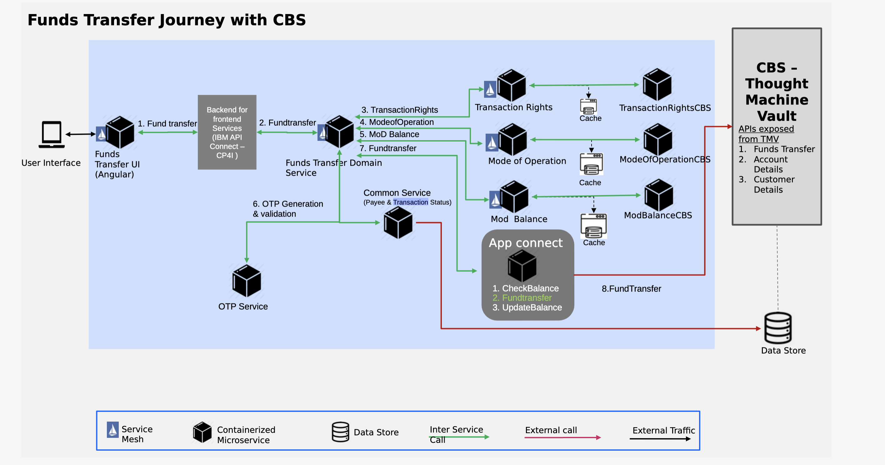

## Table of Contents

1. [ Fundtransfer Banking Solution ](#assetdescription)
2. [ Installation Steps ](#installationsteps)

## 1. Fundtransfer Banking Solution

In this asset, we have implemnted the fundtransfer journey  using this asset following  features are demonstrated
## Features
- Funds transfer IMPS/NEFT
- Autoscaling
- CI/CD pipeline
- Circuit breaker
 

## Included Components
- Tekton
- Service Mesh
- Helm
- OpenLiberty 
- Spring MVC
- Hazelcast

## 2. Installation Step
 * Make sure that, Service Mesh and Openshift Pipeline is installed on your cluster.
 * login to your target openshift cluster
 * Clone this repo to your locase
 * cd deployscripts
 * run ./startbuild.sh
 * this will build and install this microservice on your cluster.
 * update the secret for your CBS instance credentials.

